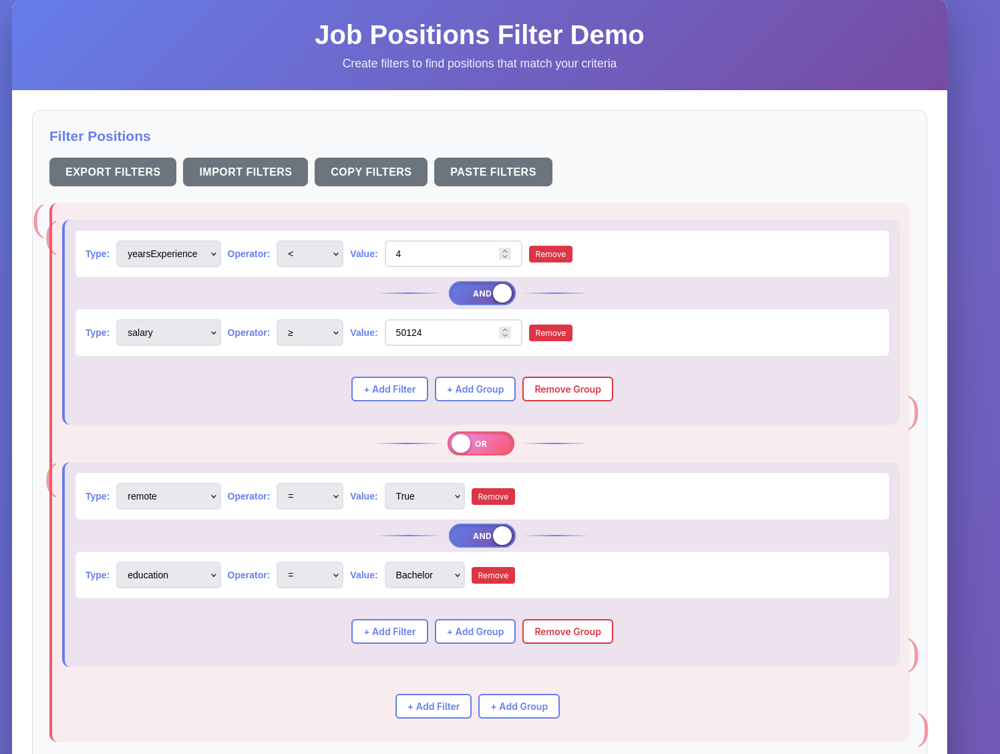

filter-builder

A reusable Preact-based filter builder UI component with AND/OR boolean connectors.


# [Live Demo](https://cute-empanada-425012.netlify.app/)

## Overview

This library provides a flexible filter builder interface that allows users to create complex filter expressions with boolean logic. Filters can be defined dynamically through a schema, making it adaptable to different use cases.

## Features

- Dynamic filter definitions via schema
- AND/OR boolean connectors
- Nested filter groups
- JSON Logic serialization/deserialization
- Import/export functionality
- Customizable styling via CSS variables

## Installation

```bash
npm install filter-builder
```

## Peer Dependencies

- `@preact/signals`: ^1.2.0
- `htm`: ^3.1.0
- `preact`: ^10.19.0

## Usage

```javascript
import { FilterBuilder, useFilterState } from 'filter-builder';
import 'filter-builder/styles/filter-builder.css';

const schema = [
  { name: 'count', relations: ['<', '<=', '>', '>='], valueType: 'int' },
  { name: 'ratio', relations: ['<', '<=', '>', '>=', '==', '!='], valueType: 'float' },
  { name: 'status', relations: ['==', '!='], valueType: 'string', options: ['active', 'inactive', 'pending'] },
  { name: 'enabled', relations: ['==', '!='], valueType: 'boolean' }
];

function App() {
  const store = useFilterState(schema);
  
  return html`
    <${FilterBuilder}
      schema=${schema}
      store=${store}
      onAddFilter=${(groupId) => { /* handle add */ }}
      onUpdateFilter=${(filterId, updates) => { /* handle update */ }}
      onRemoveFilter=${(filterId) => { /* handle remove */ }}
    />
  `;
}
```

## Schema Definition

Each filter in the schema has:
- `name`: The filter type identifier
- `relations`: Array of allowed comparison operators (`<`, `<=`, `>`, `>=`, `==`, `!=`)
- `valueType`: The type of value (`'int'`, `'float'`, `'string'`, or `'boolean'`)
- `options` (optional): For `'string'` types, an array of allowed values. If provided, a dropdown will be rendered instead of a text input. Can be an array of strings or objects with `{value, label}` format.

## Demo

A demo page is included that shows the filter builder in action with a table of job positions.

### Building the Demo

To create a static bundled demo that works **without a web server**:

```bash
npm install
npm run build
```

This will create a `dist-demo` directory with a single, self-contained `index.html` file. All JavaScript, CSS, and assets are inlined into this one file, so **no web server is required**. You can:

- Double-click `dist-demo/index.html` to open it in your browser
- Or open it via the `file://` protocol (e.g., `file:///path/to/dist-demo/index.html`)

The demo source files are located in the `demo/` directory (`demo/index.html` and `demo/demo.js`).

### Running the Demo (Development)

**Note:** The development version in the `demo/` directory **requires a web server** (it uses ES modules that need to be served over HTTP). The built version above does not need a server.

To run the development demo:

1. Start a local web server from the project root:
   ```bash
   # Using Python 3
   python3 -m http.server 8000
   
   # Or using Node.js (if you have http-server installed)
   npx http-server -p 8000
   ```

2. Open your browser and navigate to:
   ```
   http://localhost:8000/demo/
   ```

### Demo Features

The demo includes:
- A table of job positions with columns for years of experience, education, location, salary, and remote work options
- A filter builder that allows you to filter positions by:
  - `yearsExperience` (integer) - numeric comparisons
  - `salary` (integer) - numeric comparisons
  - `education` (string with dropdown) - equality/inequality with predefined options
  - `location` (string with dropdown) - equality/inequality with predefined options
  - `remote` (boolean) - true/false comparisons
- Real-time filtering as you create and modify filters
- Support for complex boolean logic with AND/OR connectors

## License

MIT

